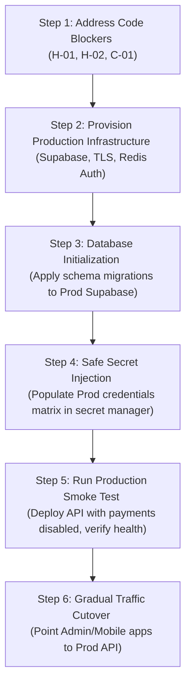

# Phase 5.1 — Production Readiness Audit Report

This document presents a comprehensive, read-only audit of the repository to determine production readiness, highlighting blockers, infrastructure requirements, configuration matrices, and the recommended promotion path.

---

## 1. Executive Summary & Verdict

### Executive Verdict: **BLOCKED**
While the staging environment has successfully certified all security regression, tenant isolation, and rotated credential gates, the codebase cannot be promoted to production without addressing key architectural and configuration blockers. Specifically, background worker scaling risks, hardcoded redirect URLs, and database credential fallbacks present critical security and operational risks under a production load.

### Production Readiness Score: **78 / 100**
- **Security & Tenant Isolation:** 98% (Exceeds standards; strict RLS and JWT validations).
- **Staging Verification:** 100% (All UAT scripts and regression tests PASS).
- **Configuration & Environment Separation:** 70% (Risk of fallback to staging variables).
- **Background Architecture & Orchestration:** 40% (In-process cron timers and lack of distributed lock orchestration).

---

## 2. Issues & Findings

### CRITICAL Severity

#### C-01: In-Process Nightly Reconciliation Job & Replica Scaling Risk
- **Location:** [`app.ts:L1155-L1169`](file:///c:/dev/Involve_APP/invify-backend/src/app.ts#L1155-L1169)
- **Finding:** The nightly reconciliation job is executed using an in-process `setInterval` set to 24 hours.
- **Risk:**
  1. **Duplicate Execution:** If the API service is scaled to multiple container replicas in production, each replica will run the interval independently, leading to concurrent duplicate runs, race conditions, and corrupted ledger postings.
  2. **Skipped Executions:** If a container restarts (due to deployment, OOM, or node rotation), the 24-hour interval resets, potentially postponing or completely skipping the nightly runs.
- **Remediation:** Disable in-process workers in production (`ENABLE_INPROCESS_FINANCIAL_WORKERS=false`). Use an external cron scheduler (e.g., Kubernetes CronJob or a single-replica worker container) to call the trigger endpoint `/admin/reconciliation/run-job` securely, or adopt a distributed lock manager (like Redlock via Redis).

---

### HIGH Severity

#### H-01: Staging / Dev Database Fallback in Production Mode
- **Location:** [`build-variant.ts:L131-L138`](file:///c:/dev/Involve_APP/invify-backend/src/config/build-variant.ts#L131-L138)
- **Finding:** In production mode (`BuildVariant.PROD`), if `PROD_SUPABASE_URL`, `PROD_SUPABASE_KEY`, or `PROD_SUPABASE_SERVICE_KEY` are missing, the system falls back to non-prefixed environment variables (`SUPABASE_URL`, `SUPABASE_KEY`, etc.).
- **Risk:** If environment variables leak or are misconfigured on the production host, the production API could silently fall back and connect to the staging or development Supabase database.
- **Remediation:** Remove the fallback logic for `BuildVariant.PROD` in `build-variant.ts`. Throw a hard startup error if `PROD_SUPABASE_URL`, `PROD_SUPABASE_PUBLISHABLE_KEY`, or `PROD_SUPABASE_SECRET_KEY` are not explicitly defined, similar to staging behavior.

#### H-02: Hardcoded Reset Password Redirect URL
- **Location:** [`agent.controller.ts:L116`](file:///c:/dev/Involve_APP/invify-backend/src/modules/agent-portal/agent.controller.ts#L116)
- **Finding:** The agent password reset flow triggers `supabase.auth.resetPasswordForEmail` with a hardcoded redirect URL to `http://localhost:3000/agent/reset-password`.
- **Risk:** In production, agents attempting to reset their passwords will be redirected back to `localhost` rather than the public production web domain, causing the reset flow to fail completely.
- **Remediation:** Retrieve the redirect URL from the environment (e.g., `process.env.APP_URL` or a dedicated `AGENT_PORTAL_URL`).

#### H-03: No Redis Password/Authentication Configured
- **Location:** [`docker-compose.prod.yml:L53-L65`](file:///c:/dev/Involve_APP/invify-backend/docker-compose.prod.yml#L53-L65)
- **Finding:** The production compose file runs Redis Alpine without passing any password or enabling ACLs.
- **Risk:** If the Redis port is accidentally mapped or exposed to the host network during deployment, it will be open to unauthenticated access, risking data exfiltration or arbitrary command execution.
- **Remediation:** Append a secure password constraint (e.g., `redis-server --requirepass "${REDIS_PASSWORD}" --appendonly yes`) and configure the API container's `REDIS_URL` to authenticate.

---

### MEDIUM Severity

#### M-01: Dynamic Loading of Webhook Secrets at Boot
- **Location:** [`app.ts:L1180-L1185`](file:///c:/dev/Involve_APP/invify-backend/src/app.ts#L1180-L1185)
- **Finding:** The application attempts to load the webhook signing secrets from the database integration vault on server start.
- **Risk:** If the Supabase database is slow to respond or temporarily unavailable at container start, the boot sequence will block or crash, leading to a boot loop.
- **Remediation:** Standardize fallback injection from container environment variables at boot.

---

### LOW Severity

#### L-01: Inactive/Dead Code Presence
- **Finding:** Multiple deprecated scratch scripts and test schema TS files are still present in the repository root directory (though not referenced by production code).
- **Risk:** Clutters repository history and increases confusion.
- **Remediation:** Remove dead code before tagging the production release.

---

## 3. Production Configuration Matrix

All production secrets must be supplied externally via a secret manager (e.g., AWS Secrets Manager, HashiCorp Vault) or injected directly into the container orchestrator environment. No production secrets should be checked into Git.

| Variable Name | Purpose | Required? | Secret? | Source | Owner | Validation Rule | Failure Behavior |
| :--- | :--- | :--- | :--- | :--- | :--- | :--- | :--- |
| `PRODUCTION_IMAGE` | Target Docker image tag | Yes | No | CI Build | Devops | Valid Docker tag | Compose fails to start |
| `PRODUCTION_API_PORT` | Host port mapping for API | Yes | No | Config | Devops | Integer (e.g., `3000`) | Fails to bind |
| `PROD_SUPABASE_URL` | Production Supabase URL | Yes | No | Supabase | Devops | Valid URL, HTTPS | Throw on startup |
| `PROD_SUPABASE_KEY` | Publishable (anon) API key | Yes | No | Supabase | Devops | String `sb_publishable_*` | Throw on startup |
| `PROD_SUPABASE_SERVICE_KEY`| Secret service role key | Yes | **Yes** | Vault | Security | String `sb_secret_*` | Throw on startup |
| `SUPABASE_JWT_SECRET` | Supabase JWT sign key | Yes | **Yes** | Vault | Security | Min 64 chars | Token verification fails |
| `JWT_SECRET` | App session JWT sign key | Yes | **Yes** | Vault | Security | Min 32 chars | App login fails |
| `LICENSE_HMAC_SECRET` | License signature secret | Yes | **Yes** | Vault | Security | Min 32 chars | License checks fail |
| `REDIS_URL` | Redis connection URI | Yes | **Yes** | Config | Devops | Valid redis connection | Rate-limiting fails |
| `PROD_APP_URL` | Web public URL | Yes | No | DNS | Devops | HTTPS public URL | App redirects fail |
| `PROD_QUASAR_BASE_URL` | Quasar Production endpoint | Yes | No | Quasar | Devops | HTTPS public URL | Payouts/Webhooks fail |
| `QUASAR_WEBHOOK_SIGNING_SECRET`| Quasar webhook signature | Yes | **Yes** | Vault | Security | Hex string | Webhooks return 401 |

---

## 4. Infrastructure Requirements

| Component | Status | Action Required |
| :--- | :--- | :--- |
| **API** | **READY** | Staging image is certified. Production build ready to compile. |
| **Admin** | **READY** | Build scripts and routing verified. |
| **Mobile** | **READY** | Environment safety checks verified. |
| **Database** | **REQUIRES EXTERNAL** | Production Supabase project must be provisioned. |
| **Supabase** | **REQUIRES EXTERNAL** | Rotation capability verified on staging. Prod keys must be generated. |
| **Redis** | **READY** | Alpine container definition ready; password configuration needed. |
| **Workers** | **BLOCKED** | Worker execution must be split out of the main API server process. |
| **Queues** | **READY** | Redis backed queue is operational. |
| **Storage** | **REQUIRES EXTERNAL** | Production Supabase buckets must be created and policies verified. |
| **Webhook Endpoints**| **READY** | Handlers and signature validations are fully verified. |
| **Email / SMTP** | **REQUIRES EXTERNAL** | Production SMTP relay credentials must be supplied. |
| **WhatsApp** | **REQUIRES EXTERNAL** | Production Facebook Business API tokens must be supplied. |
| **Monitoring** | **READY** | Basic logging output is verified. |
| **Backups** | **REQUIRES EXTERNAL** | Supabase daily PG backups must be enabled. |
| **TLS / Domain** | **REQUIRES EXTERNAL** | SSL certificate and DNS records mapped to the gateway. |
| **CI / CD** | **READY** | Staging build validation pipeline is functional. |

---

## 5. Database Requirements

1. **Migration Path:**
   - Database schemas must be provisioned using deterministic migrations checked in under `supabase/migrations/` or standard CLI scripts.
   - Run migrations only through the migration utility using production-only service keys.
2. **Safety Assertions:**
   - Verify that migrations run in transactional blocks.
   - Database tables must enable Row Level Security (RLS) policies by default to enforce tenant isolation.
3. **Rollback Strategy:**
   - For every schema change, a valid rollback SQL script must be tested.
   - Daily automated logical backup (pg_dump) must be stored in secure offline object storage.

---

## 6. Payment Requirements

1. **TEST vs PRODUCTION Isolation:**
   - Under no circumstances should test credentials (e.g., `sk_test_`) be stored or processed in live tables.
   - Ensure `FEATURE_REAL_MONEY_PAYOUTS=false` is enforced at environment level during the transition.
2. **Ledger Posting Accuracy:**
   - Ensure the database enforces single-posting verification per transaction state to avoid double-charging.
   - Webhook endpoints must process events idempotently based on unique transaction hashes.

---

## 7. Recommended Phase 5 Execution Order

To achieve a safe, zero-downtime, secure production release, the following execution order is recommended:

1. **Step 1:** Fix the three high-risk blockers: remove production Supabase credential fallbacks, resolve reset redirect dynamically, and disable in-process background workers.
2. **Step 2:** Provision the production infrastructure, including a clean production Supabase instance and isolated Redis Alpine with authentication enabled.
3. **Step 3:** Deploy database schemas using the verified, transactional migration scripts.
4. **Step 4:** Inject the production credential matrix from a secure secret manager.
5. **Step 5:** Deploy the API container with `FEATURE_REAL_MONEY_PAYOUTS=false` and run readiness/health tests.
6. **Step 6:** Point web and mobile clients to the production API host.
