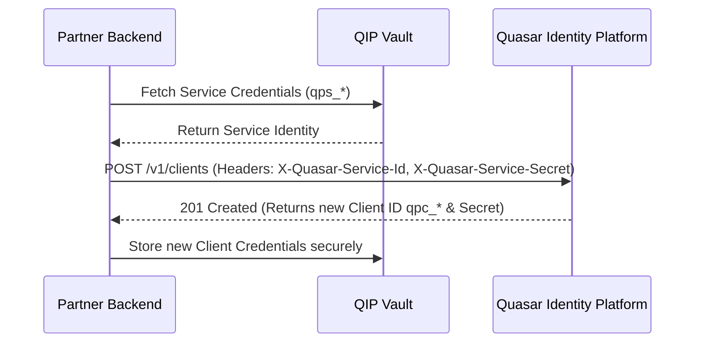
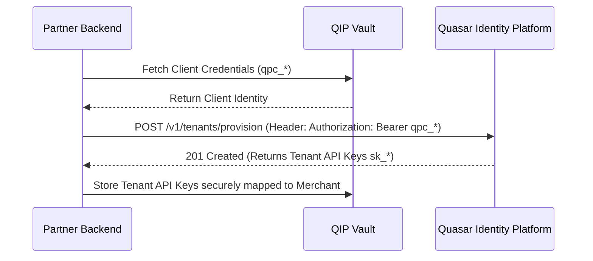
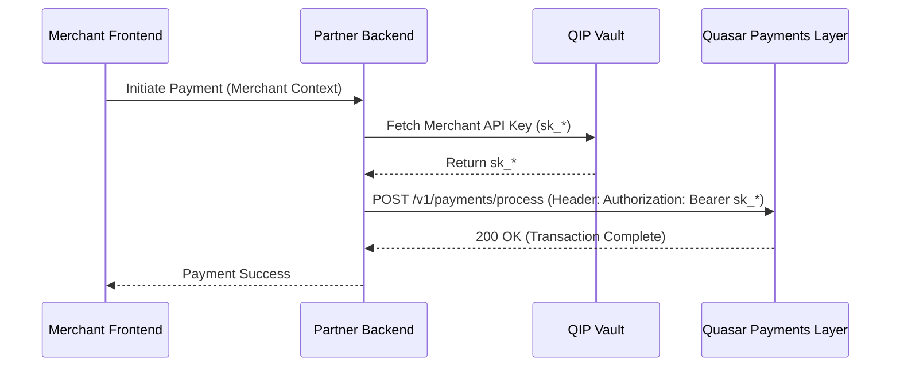

# Identity Sequence Diagrams

## 1. Service Administration (Creating a Client)

```mermaid
sequenceDiagram
    participant Partner Backend
    participant QIP Vault
    participant Quasar Identity Platform

    Partner Backend->>QIP Vault: Fetch Service Credentials (qps_*)
    QIP Vault-->>Partner Backend: Return Service Identity
    Partner Backend->>Quasar Identity Platform: POST /v1/clients (Headers: X-Quasar-Service-Id, X-Quasar-Service-Secret)
    Quasar Identity Platform-->>Partner Backend: 201 Created (Returns new Client ID qpc_* & Secret)
    Partner Backend->>QIP Vault: Store new Client Credentials securely
```

## 2. Tenant Provisioning

```mermaid
sequenceDiagram
    participant Partner Backend
    participant QIP Vault
    participant Quasar Identity Platform

    Partner Backend->>QIP Vault: Fetch Client Credentials (qpc_*)
    QIP Vault-->>Partner Backend: Return Client Identity
    Partner Backend->>Quasar Identity Platform: POST /v1/tenants/provision (Header: Authorization: Bearer qpc_*)
    Quasar Identity Platform-->>Partner Backend: 201 Created (Returns Tenant API Keys sk_*)
    Partner Backend->>QIP Vault: Store Tenant API Keys securely mapped to Merchant
```

## 3. Merchant Payments

```mermaid
sequenceDiagram
    participant Merchant Frontend
    participant Partner Backend
    participant QIP Vault
    participant Quasar Payments Layer

    Merchant Frontend->>Partner Backend: Initiate Payment (Merchant Context)
    Partner Backend->>QIP Vault: Fetch Merchant API Key (sk_*)
    QIP Vault-->>Partner Backend: Return sk_*
    Partner Backend->>Quasar Payments Layer: POST /v1/payments/process (Header: Authorization: Bearer sk_*)
    Quasar Payments Layer-->>Partner Backend: 200 OK (Transaction Complete)
    Partner Backend-->>Merchant Frontend: Payment Success
```
